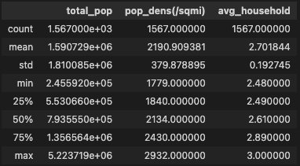
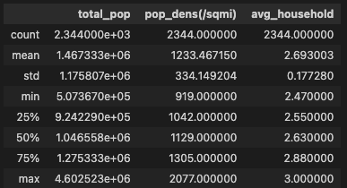
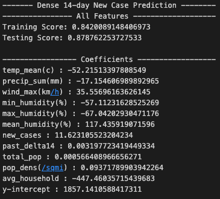
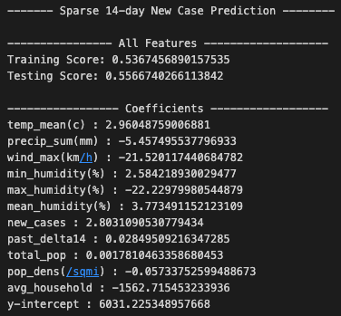

# Group 2 Final Project 
# Deliverable 2
[You can access the slides for our presenation here](https://docs.google.com/presentation/d/1bmWt08kAk6qkuKMaIf04VX2puugKRtD1Zavwt2B1TGY/edit?usp=sharing)

## Selected Topic and Reasoning   
As a group we're looking at combining weather and Covid 19 datasets.  We are hoping to use multiple linear regression to determine what, if any effect, does weather have on the covid infection rate. 

When looking at databases, we discovered that our most immediate challenge would be determining scope of the study.  There are massive amounts of weather and covid data. We started doing research into pre-existing papers on the topic. We started out looking at the relationship between weather and the spread of Covid-19, after reviewing existing research, we chose to create four tables: one for county population density, one for county weather data and two for covid data (separated into sparse and dense by population density in the county). 

### Questions we plan to answer with the project 
+ Does the weather have a significant impact on covid 19 cases seen in the next week?
+ Can we use machine learning models to predict the number of COVID-19 cases based on temperature?
+ Does the temperature two weeks previously affect the covid infection rate? 

## Data Exploration
### Working with the Covid Data
We knew we were interested in working with Covid Data right away, we found our Covid dataset first, and looked at what kind of questions we wanted to ask with it. The first decision we were faced with was which counties to use, as we unfortunately lacked the capacity to do this with the entirity of the United States. 

We then collected and cleaned the covid data using pandas.  We created a dataframe from daily covid cases data, and used that data to create a column for total cases on that date, as well as  future_delta7 and future_delta14 which represent the change in number of covid cases from today to 7 days and 14 days from today respectively. We were looking to answer questions about how does the weather in the past impact covid cases in the future.

#### County Selection 
We used the following methodology to produce the list of counties, from which we pulled a random selection. 
+ NCHS
    The National Center for Health Statistics has a method for grouping counties called the Urban-Rural clssification scheme.  There are six levels, with the most urban category consisting of central counties with large metropolitan areas, and the most rural category consisting of nonmetropolitan areas.  This method of categorization was developed to study the health differences between communities on different areas of the spectrum.

    We only chose from counties that were either central or fringe metropolitan, we then futher broke down these groups into two different sets based on population density.  
+ Population Density 
   We chose two selections of counties: counties with a population density of 1000-2999 people/square mile as our sparse group, and counties with a population density of over 2999 people/square mile as our dense group.  
+ Mask Mandates
    We chose counties that did institute a formal county level mask mandate. 

### Working with the Weather Data
Once we had identified the counties we were interested in, we proceeded to gather weather data for each county on a daily basis. We extracted several key variables including the average temperature, precipitation, and wind speed. However, we encountered some challenges when working with the humidity data. While we were interested in exploring this variable, we realized that further research was necessary to fully understand the data and its interpretation. As a result, we currently have an average daily percentage humidity column, as well as minimum and maximum percentage humidity columns for each day. Despite the limitations, we believe that the weather data we were able to collect provides valuable insights into the potential relationship between weather patterns and COVID-19 incidence in the selected counties.
### Database
We created a database from the tables above in pg admin, we then connected it with the AWS server for ease of sharing and group access.  

## Analysis
### County Data
+ Source: [NCHS Urban-Rural Classification Scheme for Counties](https://www.cdc.gov/nchs/data_access/urban_rural.html)
[Average Household Size and Population Density from U.S. Census Bureau's 2014 - 2018 American Community Survey](https://covid19.census.gov/datasets/21843f238cbb46b08615fc53e19e0daf_1/explore?location=4.431457%2C0.315550%2C0.82)
+ Columns:
    + county - this is our primary key for all of the tables
    + state - state the county is in
    + avg_household - the mean household size for the county
    + total_pop - the total county population
    + pop_dens(/sqmi) - the population density for the county
    + nchs_code_2013 - the NCHS Urban-Rural Classification code for the county 

+ Dense County Data Set Descriptive Statistics:

+ Sparse County Data Set Descriptive Statistics:

### Covid Data
+ Source: [COVID-19 in USA](https://www.kaggle.com/datasets/sudalairajkumar/covid19-in-usa?select=us_counties_covid19_daily.csv) on Kaggle.
+ There are a total of 1933 and 2484 covid data points for the dense and sparse county groups respectively.
+ Columns (\*\* indicates a column created from raw data):
    + `date` - the date of the observation
    + `county` - the county in which the observation was made
    + `state` - the state in which the observation was made
    + `total_cases` - a running total of cases by day
    + `new_cases`\*\* - new cases recorded on this data
    + `past_delta14`\*\* - the total number of new cases for the past 14 days
    + `future_delta14`\*\* - the total number of new cases 14 days from now

+ Dense County Data Set Descriptive Statistics:

+ Sparse County Data Set Descriptive Statistics:

### Weather Data
+ Source: [Open-Meteo](https://open-meteo.com/en/docs/historical-weather-api#latitude=39.96&longitude=-83.00&start_date=2023-02-14&end_date=2023-03-15&hourly=temperature_2m).
+ There are 2562 and 3294 weather data points for the dense and sparse county groups respectively. Weather data was compiled for the entire year of 2020.
+ Columns:
    + `date` - date of the observation
    + `county` - county in which the observation was made
    + `state` - state in which the observation was made
    + `temp_mean(C)` - mean temperature for the day in Celcius
    + `precip_sum(mm)` - total precipitation for the day in millimeters
    + `wind_max(km/h)` - the maximum wind observation for the day at 10 meters above ground in kilometers per hour
    + `min_humidity(%)` - the minimum humidity observation for the day as a percentage
    + `max_humidity(%)` - the maximum humidity observation for the day as a percentage
    + `mean_humidity(%)` - the arithmetic mean of hourly humidity observations for the data as a percentage.
+ Dense County Data Set Descriptive Statistics:

+ Sparse County Data Set Descriptive Statistics:

### Data Models
We decided to create two separate models, each corresponding to a specific set of county data. While the models were constructed in the same manner, they were trained using their respective datasets. Specifically, we employed a Multiple Linear Regression model and fed all relevant quantitative data into it. The resulting model outputs are summarized below.

+ Dense County Model:

+ Sparse County Model:

As can be seen, the Dense Model performed far better than the sparse model. There are two possibilities that we suspect for this.

1. There are fewer observations in the Dense County data set, and so the model is required to generalize less than the Sparse County Model.

2. There is a significant, underlying difference between the counties in the Sparse data set that is not captured in the above data.

## Conclusion
The project aims to explore the relationship between weather and COVID-19 cases by using multiple linear regression analysis on combined datasets. The study faced challenges in determining the scope of the project due to the vast amount of available data. We focused on comparing counties with population density and mask mandates as the criteria for selection. The COVID-19 data was collected and cleaned and created new columns for future delta7 and future delta14. The questions to be answered include identifying the correlation between temperature and COVID-19 cases, regional differences in the relationship, and the potential use of machine learning models to predict COVID-19 cases based on various factors. The project has the potential to provide insights into the impact of weather on the spread of COVID-19, which could have implications for future pandemic response strategies.

### Future Research
+ Improved understanding of the relationship between weather and Covid-19 infection rates: 
    By using multiple linear regression to explore the relationship between weather and Covid-19 infection rates, your analysis may provide new insights into how weather conditions impact the spread of the virus. This information could be useful for public health officials and policymakers in developing targeted strategies for controlling the spread of Covid-19.
+ Identification of high-risk areas: 
    Your analysis may also help identify areas that are particularly vulnerable to Covid-19 outbreaks based on weather conditions. This information could be useful for directing resources and interventions to those areas in order to mitigate the spread of the virus.

### Limiations
+ Limiations based on our county selection
We chose a small number of cities based on their population density and National Center for Health Statistics rating.  This was intended to create a manageable pool of data that we could process in the time provided. However, it does mean that we don't know how this model applies to rural/non-metropolitan areas. 
+ Limitations to the covid data
There were questions, for example, about counties reporting an increased number of cases on Monday because they were counting cases from the weekend in that number. We created future and past delta variables to give us a variable for active cases at one time, we were limited by the data collection.  

## Technologies Used
+ Python v3.10.9
+ Pandas v1.5.3
+ SciKit Learn v1.2.1
+ Postgres (via AWS) v
+ Jupyter Notebook v6.5.2
+ SQLAlchemy v1.4.47 (v 1.4 required for [MLR_model_2](models/MLR_model_2.ipynb))
+ pgAdmin v6.16
+ Postgres v11.19
