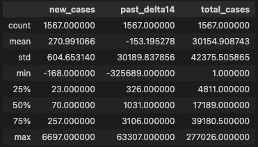
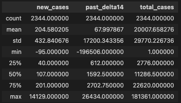
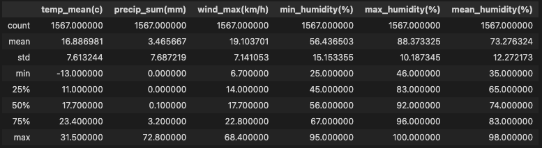
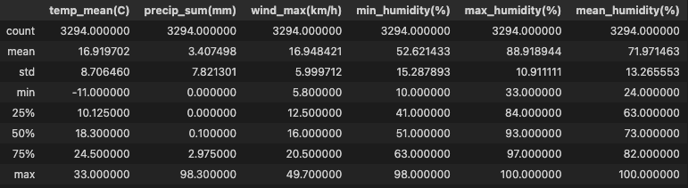

# Group 2 Final Project 
# Deliverable 1
## Selected Topic and Reasoning   
As a group we're looking at combining weather and Covid 19 datasets.  We are hoping to use multiple linear regression to determine what, if any effect, does weather have on the covid infection rate. 

When looking at databases, we discovered that our most immediate challenge would be determining scope of the study.  There are massive amounts of weather and covid data. We started doing research into pre-existing papers on the topic. We started out looking at the relationship between weather and the spread of Covid-19, after reviewing existing research, we chose to create three tables: one for county weather data and two for covid data (separated into sparse and dense by population density in the county). 

### Limiations
+ Limiations based on our county selection
+ Limitations based on the data sets 
+ Limiations from working with weather data 
+ There are alot of limitations so whatever anyone else can think of 

### Questions we plan to answer with the project 
+ Does the weather have a significant impact on covid 19 cases seen in the next week?
+ Can we use machine learning models to predict the number of COVID-19 cases based on temperature ?
+ Forming a more coherent hypothesis here with specific goal

## Data Exploration
### Working with the Covid Data
We found our covid data first, which was organized by counties. The first decision we were faced with was which counties to use, as we unfortunately lacked the capacity to do this with the entirity of the United States.  We used the following methodology to produce the list of counties below.  

+ NCHS
    The National Center for Health Statistics has a method for grouping counties called the Urban-Rural clssification scheme.  There are six levels, with the most urban category consisting of central counties with large metropolitan areas, and the most rural category consisting of nonmetropolitan areas.  This method of categorization was developed to study the health differences between communities on different areas of the spectrum.

    We only chose from counties that were either central or fringe metropolitan, we then futher broke down these groups into two different sets based on population density.  

+ Population Density 
    We chose the following criteria: population density and covid mask mandates. To make our counties all comparable, we only chose counties that did instate a mask mandate. We chose two selections of counties: counties with a population density of 1000-2999 people/square mile as our sparse group, and counties with a population density of 4000-6999 people/square mile as our dense group.  We used data collected by the US census to determine county population density.

Below are our chosen counties with their state and NCHS score: 
1. <b> Dense Counties: </b> Baltimore City, Maryland (2); Essex, New Jersey (2); Cook, Illinois(1); Union, New Jersey(1); Norfolk, Virginia(1); Nassau, New York (2)
2. <b> Sparse Counties: </b> Fairfax County, Virginia (2); Camden County, New Jersey (2); Harris County, Texas(1); Franklin County, Ohio (1); Marion County, Indiana (1); Dekalb County, Georgia (2); Duval County, Florida (1); Wake County, North Carolina(1); Bexar County, Texas (1)

We then collected and cleaned the covid data using pandas.  We created a dataframe from daily covid cases data, and used that data to create a column for total cases on that date, as well as  future_delta7 and future_delta14 which represent the change in number of covid cases from today to 7 days and 14 days from today respectively.We were looking to answer questions about how does the weather in the past impact covid cases in the future.  Does the temperature two weeks previously affect the covid infection rate? 

### Working with the Weather Data
+ Where we got the data 
+ What variables we chose to look at
Once we had identified the counties we were interested in, we found weather data for each county by day.  We pulled out the average temperature, precipitation, windspeed, and ran into some complications surrounding hummidity.  We were interested in exploring it, but need to do further research to best understand what the data represents.  For now we have an average daily percent humidity column, as well as a min and max percent humidity for each day.  
+ questions to look into that came out of the weather data
This section can be shorter than the covid section because we did spend alot of time in that section discussing why we chose the counties we chose. 

### Database
We created a database from the tables above in pg admin, we then connected it with the AWS server for ease of sharing and group access.  

## Preliminary Analysis 
### Covid Data
+ Source: [COVID-19 in USA](https://www.kaggle.com/datasets/sudalairajkumar/covid19-in-usa?select=us_counties_covid19_daily.csv) on Kaggle.
+ There are a total of 1933 and 2484 covid data points for the dense and sparse county groups respectively.
+ Columns (\*\* indicates a column created from raw data):
    + `date` - the date of the observation
    + `county` - the county in which the observation was made
    + `state` - the state in which the observation was made
    + `total_cases` - a running total of cases by day
    + `new_cases`\*\* - new cases recorded on this data
    + `future_delta7`\*\* - the total number of new cases 7 days from now
    + `future_delta14`\*\* - the total number of new cases 14 days from now

+ Dense County Data Set Descriptive Statistics:

+ Sparse County Data Set Descriptive Statistics:

### Weather Data
+ Source: [Open-Meteo](https://open-meteo.com/en/docs/historical-weather-api#latitude=39.96&longitude=-83.00&start_date=2023-02-14&end_date=2023-03-15&hourly=temperature_2m).
+ There are 2562 and 3294 weather data points for the dense and sparse county groups respectively. Weather data was compiled for the entire year of 2020.
+ Columns:
    + `date` - date of the observation
    + `county` - county in which the observation was made
    + `state` - state in which the observation was made
    + `temp_mean(C)` - mean temperature for the day in Celcius
    + `precip_sum(mm)` - total precipitation for the day in millimeters
    + `wind_max(km/h)` - the maximum wind observation for the day at 10 meters above ground in kilometers per hour
    + `min_humidity(%)` - the minimum humidity observation for the day as a percentage
    + `max_humidity(%)` - the maximum humidity observation for the day as a percentage
    + `mean_humidity(%)` - the arithmetic mean of hourly humidity observations for the data as a percentage.
+ Dense County Data Set Descriptive Statistics:

+ Sparse County Data Set Descriptive Statistics:

## Outline for Presentation 
1. Introduction to the topic
2. Overview of database
    + covid data: selecting counties and compiling data, creating futuredelta value
        + sparse county 
        + dense county  
    + weather data
3. Machine Learning Model
    + Multiple linear regression 
4. Visualizations 
    + Covid cases by county vs average temp 
    + Maps 

## Conclusion
The project aims to explore the relationship between weather and COVID-19 cases by using multiple linear regression analysis on combined datasets. The study faced challenges in determining the scope of the project due to the vast amount of available data. We focused on comparing counties with population density and mask mandates as the criteria for selection. The COVID-19 data was collected and cleaned and created new columns for future delta7 and future delta14. The questions to be answered include identifying the correlation between temperature and COVID-19 cases, regional differences in the relationship, and the potential use of machine learning models to predict COVID-19 cases based on various factors. The project has the potential to provide insights into the impact of weather on the spread of COVID-19, which could have implications for future pandemic response strategies.

### Future Research
+ <b> add another point here about where what we should look into in the future based on our initial findings </b> 
+ Improved understanding of the relationship between weather and Covid-19 infection rates: 
    By using multiple linear regression to explore the relationship between weather and Covid-19 infection rates, your analysis may provide new insights into how weather conditions impact the spread of the virus. This information could be useful for public health officials and policymakers in developing targeted strategies for controlling the spread of Covid-19.
+ Identification of high-risk areas: 
    Your analysis may also help identify areas that are particularly vulnerable to Covid-19 outbreaks based on weather conditions. This information could be useful for directing resources and interventions to those areas in order to mitigate the spread of the virus.
